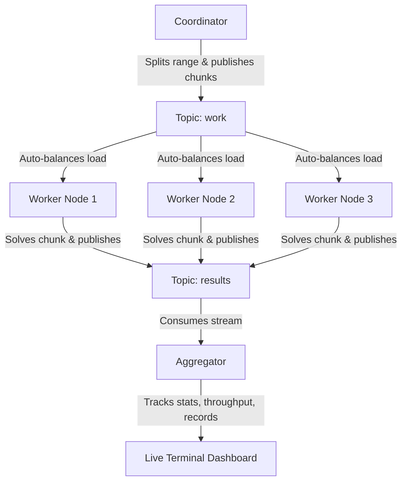

# Distributed Collatz Verifier

A high-performance, fault-tolerant distributed system that verifies the Collatz conjecture across massive number ranges using Apache Kafka and Java 17+.

This project is built from scratch without Spring Boot or heavy frameworks to demonstrate core distributed systems design, Kafka internals, and raw JVM execution performance.

---

## Architecture

The system is composed of four main components running independently and communicating asynchronously through Kafka:



1. **Coordinator**: Divides a target range (e.g. $[10^{20}, 10^{20} + 1,000,000]$) into $N$ balanced work chunks and publishes them to the `work` topic.
2. **Worker(s)**: Consume chunk assignments from the `work` topic, compute the Collatz chain length for each number, find the longest chain in the chunk, publish results to the `results` topic, and commit offsets.
3. **Aggregator**: Consumes from the `results` topic, updates global statistics (running throughput, longest chain record), and prints a live dashboard to the console.
4. **Kafka Broker**: Acts as the message backbone. Configured to automatically partition work across 3 partitions to enable horizontal scaling and consumer-group rebalancing.

---

## Tech Stack and Requirements

* **Java 17+** (using `BigInteger` for numbers exceeding 64-bit bounds)
* **Maven 3+** (dependency management)
* **Apache Kafka 3.7.0** (running locally via Docker in KRaft mode)
* **Jackson Databind** (JSON serialization)
* **tmux** (optional, for terminal split-pane orchestration)

---

## Quick Start (Automated Demo)

If you have `tmux` installed on your machine, you can run the entire system (Kafka startup, compilation, and spawning of 2 workers, 1 aggregator, and 1 coordinator in a split-screen layout) with a single command:

```bash
./demo.sh
```

* **To exit the tmux layout**: Press `Ctrl+B` then `D` to detach, or type `exit` in each pane.
* **To stop the Kafka container afterward**:
  ```bash
  docker compose down
  ```

---

## Manual Execution (Step-by-Step)

If you want to run the components manually in separate terminal windows:

### 1. Start Kafka
```bash
docker compose up -d
```
*(Kafka is configured via `docker-compose.yml` to automatically create topics with 3 partitions).*

### 2. Start the Aggregator (Terminal 1)
```bash
mvn compile exec:java -Dexec.mainClass="com.collatz.Aggregator"
```

### 3. Start Worker 1 (Terminal 2)
```bash
mvn compile exec:java -Dexec.mainClass="com.collatz.Worker"
```

### 4. Start Worker 2 (Terminal 3)
```bash
mvn compile exec:java -Dexec.mainClass="com.collatz.Worker"
```

### 5. Run the Coordinator (Terminal 4)
```bash
mvn compile exec:java -Dexec.mainClass="com.collatz.Coordinator"
```

---

## Core Kafka Concepts

* **Partitions and Parallelism**: A topic is divided into partitions. Kafka distributes these partitions across consumers in a consumer group. If a topic has 3 partitions, up to 3 workers can process messages concurrently.
* **Consumer Groups**: Multiple worker processes cooperate under the group `collatz-workers-group`. Kafka automatically routes different partitions to different workers.
* **Rebalancing and Fault Tolerance**: If a worker crashes mid-chunk, Kafka detects the heartbeat failure, triggers a rebalance, and reassigns its partition to a surviving worker.
* **Offsets and At-Least-Once Delivery**: Workers disable auto-commit and call `consumer.commitSync()` only after completing a chunk. If a worker dies mid-chunk, the next worker re-reads the chunk from the last committed offset, ensuring no work is lost.
* **Key-Based Partitioning**: Chunks are published using `chunkId` as the key. Kafka hashes the key to assign it to a partition (`hash(key) % partitions`), ensuring ordering guarantees.

---

## Performance Optimizations

* **BigInteger Bit-Shifting**: Instead of slow division `currentVal.divide(TWO)`, we use `currentVal.shiftRight(1)` which is implemented as a fast binary shift.
* **Odd/Even LSB Checks**: Instead of slow modulo math `currentVal.mod(TWO).equals(ZERO)`, we use `!currentVal.testBit(0)` to read the least significant bit directly.
* **Memory & GC Footprint**: Dropped active `HashSet` cycle detection to prevent JVM Garbage Collector thrashing, relying instead on a step threshold counter.
